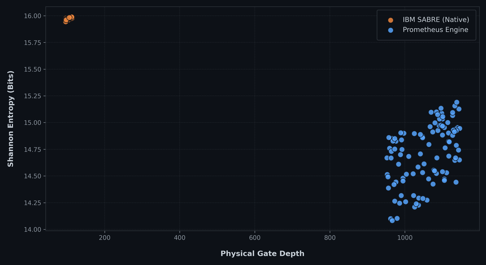

# Prometheus Benchmark: Distributional Concentration

### Executive Summary
Experimental IBM Quantum benchmark showing that dramatically higher physical routing cost can produce substantially more concentrated output distributions, demonstrating that physical circuit cost alone does not determine measured distribution quality.

Prometheus produced a substantially more concentrated output distribution on IBM Heron hardware despite using 9.6× more physical two-qubit gates and 7× greater circuit depth than SABRE O3.

While conventional quantum compilation focuses on minimizing physical two-qubit (2Q) gate count and overall circuit depth, the enclosed experiments demonstrate that this combinatorial optimization is not always sufficient to maximize output signal on a real superconducting QPU. In specific topological regimes, Prometheus intentionally generates substantially more routing operations—incurring a severe physical depth penalty—yet produces output distributions with stronger structural concentration. 

Crucially, the data enclosed demonstrates that **distributional concentration and distributional agreement are separable variables**. The benchmark therefore motivates evaluating hardware execution behavior alongside conventional circuit-cost metrics, rather than treating physical gate count and depth as sufficient proxies for the resulting output distribution.

---

### Central Finding
> **Physical routing cost does not uniquely determine output distribution quality.**
>
> $$
> \Delta C_{\mathrm{routing}} > 0, \quad \Delta S_{\mathrm{entropy}} < 0
> $$
>
> (Where $S_{\mathrm{entropy}}$ represents the Shannon Entropy of the measured distribution).

In other Prometheus experiments, this distributional concentration can also coincide with higher Hellinger fidelity and application-level performance.

### Visual Evidence: Expansive Routing vs. Output Entropy
The telemetry data below visualizes the decoupling of routing cost and hardware output shape. The Prometheus Engine (blue) intentionally inflates physical gate depth by roughly 10x compared to the native IBM SABRE compiler (orange). 

Despite the severe depth penalty, the Prometheus mapping produces a substantially more concentrated measured output distribution.



---

### 1. Phenomenon A: Distributional Concentration
A 100,000-shot execution was performed on an 8-qubit hardware benchmark (QFT-8) on `ibm_kingston`. The experiment placed both compiler outputs within the same SamplerV2 execution structure to reduce temporal execution-order confounding.

| Metric | SABRE O3 | Prometheus | $\Delta$ |
| :--- | :--- | :--- | :--- |
| **Physical depth** | 183 | 1,282 | **+1,099** |
| **Physical 2Q gates** | 91 | 875 | **+784** |
| **Shannon entropy** | 7.9554 | 6.6045 | **-1.3509** |

**7× deeper. 9.6× more 2Q gates. Lower output entropy.**
*Same logical workload. Same QPU. Same execution framework. Different physical realization.*

### 2. Phenomenon B: Concentration is not Agreement
Shannon entropy measures the concentration of the measured distribution; it does not determine whether that probability mass is concentrated around the ideal outcomes. Distributional concentration and distributional agreement are therefore treated as separate observables in the Prometheus benchmark suite.

$$
\text{Distribution quality} = f(\text{concentration}, \text{agreement}, \text{hardware cost})
$$

As shown in the extended metrics for the QFT-8 execution, lower entropy does not itself automatically establish higher overall agreement:

| Metric | SABRE O3 | Prometheus | $\Delta$ |
| :--- | :--- | :--- | :--- |
| **KL Divergence** | 0.0453 | 1.6370 | **+1.5917** |
| **HOP** | 0.4849 | 0.4251 | **-0.0598** |

Here, $S_{\mathrm{Prom}} < S_{\mathrm{SABRE}}$, but $D_{\mathrm{KL, Prom}} \gg D_{\mathrm{KL, SABRE}}$. This distinction is critical: routing cost, distributional concentration, and distributional agreement are separable variables in hardware-aware compilation.

### 3. 2,000-Shot Baseline (ibm_fez)
A 5-qubit Asymmetrical EfficientSU2 baseline experiment evaluated target-state concentration. 

| Pipeline | Unique measured bitstrings | Top-5 probability mass | Most frequent state |
| :--- | :--- | :--- | :--- |
| **SABRE O3** | 32 / 32 | 688 / 2,000 shots (34.4%) | 179 shots |
| **Prometheus** | 22 / 32 | 1,861 / 2,000 shots (93.0%) | 915 shots |

Prometheus produced a materially higher Top-5 probability mass (93.0% vs 34.4%) under identical back-to-back calibration conditions.

---

### 4. Explicit Terminology Matrix
To ensure precision when evaluating the enclosed payloads, this repository adheres to the following definitions:

* **Distributional shape:** Shannon entropy, unique outcomes, Top-1 probability, Top-5 probability mass.
* **Distributional agreement:** Hellinger fidelity, Total Variation Distance (TVD), KL divergence.
* **Hardware execution cost:** 2Q count, circuit depth, routing overhead, physical couplers used.

### 5. Data Provenance & Tooling
To ensure independent reproducibility without requiring trust in the Prometheus compiler implementation, the raw execution payloads downloaded directly from IBM Quantum are provided in the `/data/` directory.

```bash
cd 01-distributional-concentration
python scripts/local_telemetry_extractor.py

## Public evidence package

This experiment retains the logical workload(s), public aggregate data/figures supplied in the research archive, and the available IBM returned-result payloads. Routed and translated circuit artifacts are intentionally excluded.

### IBM evidence
- `data/job-d8mi4ro32u0s73fb90cg-result.json` — returned IBM execution result.
- `data/job-d8mi5g832u0s73fb9130-result.json` — returned IBM execution result.
- `data/job-d8mi63b2d42s73ccmu30-result.json` — returned IBM execution result.
- `data/job-d8mi6lbqv2lc7387o3kg-result.json` — returned IBM execution result.
- `data/job-d8mi7832d42s73ccn0cg-result.json` — returned IBM execution result.
- `data/job-d8mi7trnn5bs738te1e0-result.json` — returned IBM execution result.
- `data/job-d8rtlleab0ds73ds43qg-result.json` — returned IBM execution result.
- `data/job-d8ru0e6gbcrc73f500g0-result.json` — returned IBM execution result.

### Logical workloads
0 logical QASM file(s) are retained where supplied.

